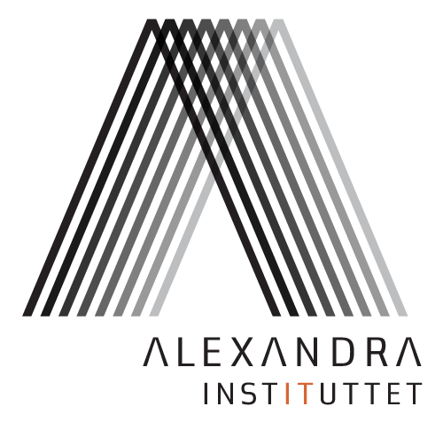

DaNLP
==============
[](https://opensource.org/licenses/BSD-3-Clause)

DaNLP is a repository for Natural Language Processing resources for the Danish Language. It is a collection  of available datasets and models for a a variety of NLP tasks. It features code examples on how to use the datasets and models in popular NLP frameworks such as spaCy and NLTK as well as Deep Learning frameworks such as PyTorch and TensorFlow.

The aim for this project is both to point to the open source tool available in Danish, and to add new models and tools to make NLP in Danish more applicable for everybody and especially for the industry.

#### News

- DaNLP can now be installed as a pip package. 

#### Next up

This project is currently working on sentiment analysis using zero-shot transfer learning from [LASER](https://github.com/facebookresearch/LASER/tree/master/source), looking into weak supervision, a tutorial for using transfer learning with [BERT](https://github.com/google-research/bert),  and soon it will begin to look at how to support SpaCy for Danish. 

## Get started
The project is build for Python 3.6+. To get started you need to clone the project and install it with pip:

```bash
git clone git@github.com:alexandrainst/danlp.git
cd danlp
pip install .
```

The DaNLP package wraps existing NLP models for Danish, and provides scripts for downloading Danish datasets.

##### Docs 

The documentation aims to provide the following:

- Overview for each task regarding what is available in Danish in open source preferable with benchmark results

- Introduction and examples of how to run the code and use NLP for the Danish Languages and in time real case stories 

- Explanation and training details for models trained and datasets created in this project

  ​                   


## NLP Models
Natural Language Processing an active area of research and it consists of many different tasks. The DaNLP repository provides an overview of Danish models for some of the most common NLP tasks.

The repository is under development and this is the list of NLP tasks planned to be covered in the repository.
- [x] [Embedding of text](docs/models/embeddings.md)
- [x] [Part of speech](docs/models/part_of_speach_tagging.md)
- [ ] Named Entity Recognition
- [ ] Lemmatization
- [ ] Sentiment Analysis
- [ ] Coreference resolution

If you are interessted in supporting Danish for any specific NLP task you are welcome to get in contact with us.

## Datasets
The number of datasets in the Danish is limited. The DaNLP repository provides and overview of the available Danish datasets that can be used for commercial purposes.

Da DaNLP package aloud you to downloading and preprocessing dataset. In the docs you can read about the datasets  [here](/docs/datasets.md) .

## Examples
To share ideas and inspirations, the DaNLP repository will provide examples and small tutorials to show how and for what NLP in Danish can be used. It will in time also provide stories and learnings from real cases in Danish companies where NLP is applied.

Read about it in the docs [here](/examples/examples.md). 

## How do I contribute?

If you want to contribute to the DaNLP repository and make it better, your help is very welcome. You can contribute to the project in many ways:

- Help us write good tutorials on Danish NLP use-cases
- Contribute with you own pretrained NLP models or datasets in Danish
- Notify us of other Danish NLP resources
- Create GitHub issues with questions and bug reports

## Who is behind?


The DaNLP repository is maintained by the [Alexandra Institute](https://alexandra.dk/uk) which is a Danish non-profit company 
with a mission to create value, growth and welfare in society. The Alexandra Institute is a member of [GTS](https://gts-net.dk/), 
a network of independent Danish research and technology organisations.

The work on this repository is part the [Dansk For Alle](https://bedreinnovation.dk/dansk-alle-0) performance contract 
allocated to the Alexandra Insitute by the [Danish Ministry of Higher Education and Science](https://ufm.dk/en?set_language=en&cl=en). The project runs in two years in 2019 and 2020.
