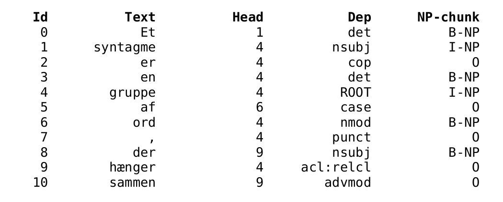

Noun-Phrase (NP) Chunking
====================

Chunking is the task of grouping words of a sentence into syntactic phrases (e.g. noun-phrase, verb phrase). 
Here, we focus on the prediction of noun-phrases. Noun phrases can be pronouns, proper nouns or nouns (potentially bound with adjectives or verbs). 
In sentences, noun phrases are generally used as subjects or objects (or complements of prepositions).
Examples of noun-phrases :
 * en `bog` (NOUN)
 * en `god bog` (ADJ+NOUN)
 * en `reserveret bog` (VERB+NOUN)

NP-chunks can be deduced from dependencies. 
The NP-chunking "model" is thus a convertion function depending on a [dependency model](https://github.com/alexandrainst/danlp/blob/master/docs/models/dependency.md) which has been trained on the Danish UD treebank.

| Model | Train Data | License | Trained by | Tags | DaNLP |
|-------|-------|-------|-------|-------|-------|
| [SpaCy](https://github.com/alexandrainst/danlp/blob/master/docs/models/chunking.md#spacy) | [Danish Dependency Treebank](<https://github.com/alexandrainst/danlp/blob/master/docs/datasets.md#danish-dependency-treebank-dane>) | MIT | Alexandra Institute | NP | ✔️ |

##### :wrench:SpaCy

Read more about the SpaCy model in the dedicated [SpaCy docs](<https://github.com/alexandrainst/danlp/blob/master/docs/spacy.md>) , it has also been trained using the [Danish Dependency Treebank](<https://github.com/alexandrainst/danlp/blob/master/docs/datasets.md#danish-dependency-treebank-dane>) dataset. 

## 📈 Benchmarks

NP chunking scores (F1) are reported below :

| Model | Precision | Recall | F1    |
|-------|-----------|--------|-------|
| SpaCy | 91.32     | 91.79  | 91.56 |

See detailed scoring of the benchmarks in the [example](<https://github.com/alexandrainst/danlp/tree/master/examples>) folder.