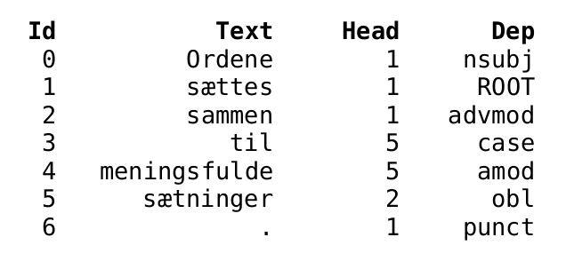
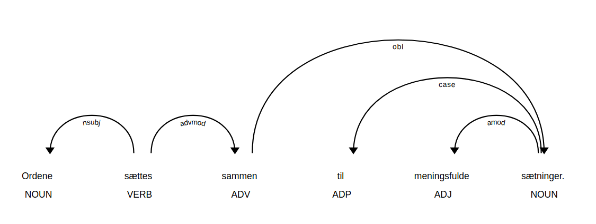

Dependency Parsing
======================

Dependency parsing is the task of extracting a dependency parse of a sentence. 
It is typically represented by a directed graph that depicts the grammatical structure of the sentence; where nodes are words and edges define syntactic relations between those words. 
A dependency relation is a triplet consisting of: a head (word), a dependent (another word) and a dependency label (describing the type of the relation).


| Model | Train Data | License | Trained by | Tags | DaNLP |
|-------|-------|-------|-------|-------|-------|
| [SpaCy](https://github.com/alexandrainst/danlp/blob/master/docs/models/dependency.md#spacy) | [Danish Dependency Treebank](<https://github.com/alexandrainst/danlp/blob/master/docs/datasets.md#danish-dependency-treebank-dane>) | MIT | Alexandra Institute | 17  Universal dependencies | ✔️ |


The model has been trained on the Danish UD treebank which have been annotated with dependencies following the [Universal Dependency](https://universaldependencies.org/u/dep/index.html) scheme.
It uses 39 dependency relations.


##### :wrench:SpaCy

Read more about the SpaCy model in the dedicated [SpaCy docs](<https://github.com/alexandrainst/danlp/blob/master/docs/spacy.md>) , it has also been trained using the [Danish Dependency Treebank](<https://github.com/alexandrainst/danlp/blob/master/docs/datasets.md#danish-dependency-treebank-dane>) dataset. 

Below is a small getting started snippet for using the SpaCy dependency parser:

```python
from danlp.models import load_spacy_model

# Load the dependency parser using the DaNLP wrapper
nlp = load_spacy_model()

# Using the spaCy dependency parser
doc = nlp('Ordene sættes sammen til meningsfulde sætninger.')

dependency_features = ['Id', 'Text', 'Head', 'Dep']
head_format = "\033[1m{!s:>11}\033[0m" * (len(dependency_features) )
row_format = "{!s:>11}" * (len(dependency_features) )

print(head_format.format(*dependency_features))
# Printing dependency features for each token 
for token in doc:
    print(row_format.format(token.i, token.text, token.head.i, token.dep_))
```




**Visualizing the dependency tree with SpaCy**

```python
# SpaCy visualization tool
from spacy import displacy

# Run in a terminal 
# In jupyter use instead display.render 
displacy.serve(doc, style='dep')
```





`nsubj`: nominal subject, 
`advmod`: adverbial modifier, 
`case`: case marking, 
`amod`: adjectival modifier, 
`obl`: oblique nominal, 
`punct`: punctuation


## 📈 Benchmarks

Dependency scores — LA (labelled attachment score), UAS (Unlabelled Attachment Score) and LAS (Labelled Attachment Score) — are reported below :

| Model | LA    | UAS   | LAS   |
|-------|-------|-------|-------|
| SpaCy | 87.68 | 81.36 | 77.46 |

See detailed scoring of the benchmarks in the [example](<https://github.com/alexandrainst/danlp/tree/master/examples>) folder.